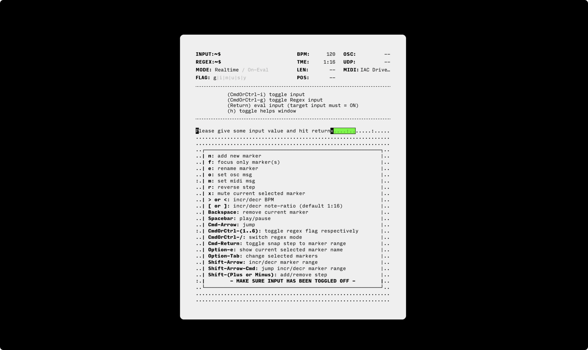
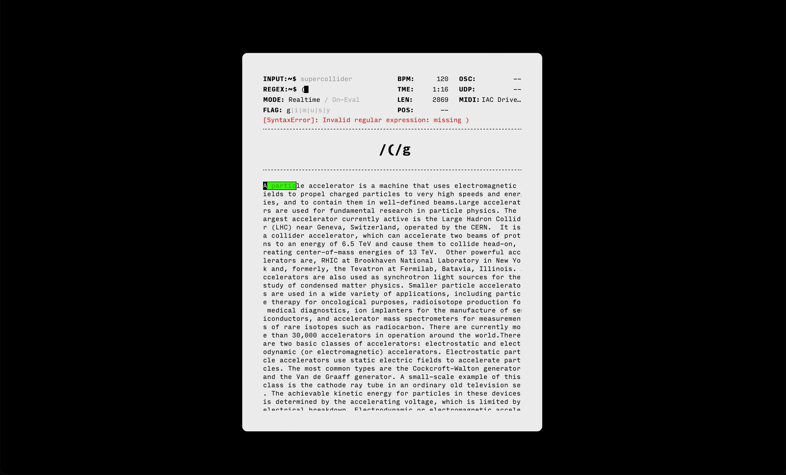
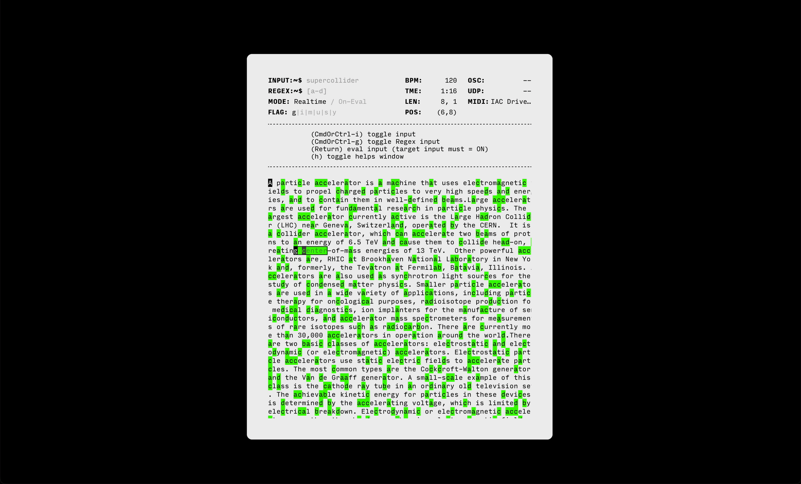
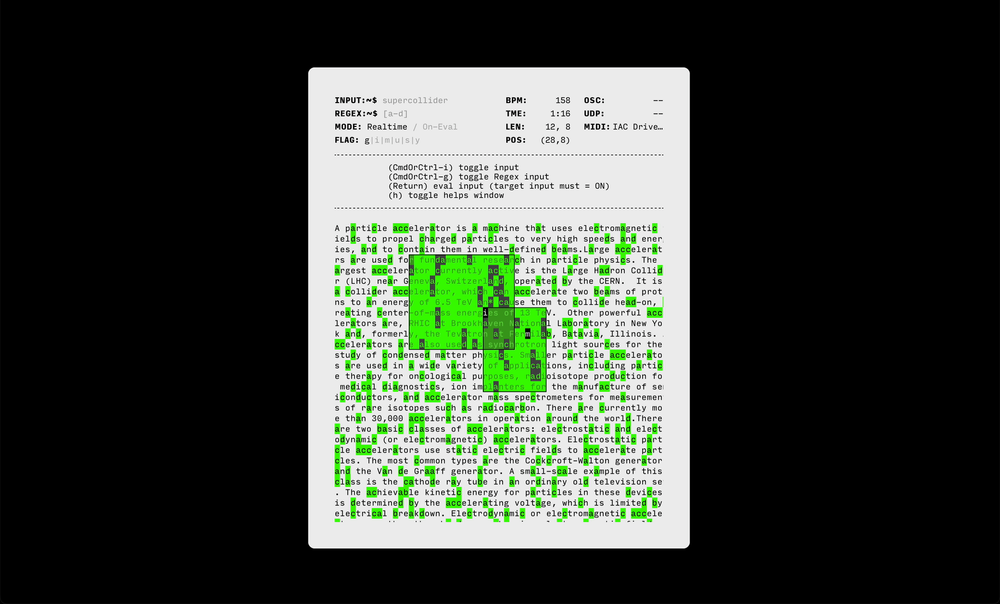

# `anu`

a tiny backend-agnostic step-sequencer/live-coding environment that harnesses the power of matching patterns ([RegEx](https://regexr.com)) to create triggers. as the name suggests "anu" (or "อนุ"), which in Thai grammar denotes a prefix meaning "small", "sub" or "minor". It can be prefixed(compatible) with any others software/hardware that support [ OSC ](https://en.wikipedia.org/wiki/Open_Sound_Control) or [MIDI](https://en.wikipedia.org/wiki/MIDI) protocol (under developing, more to be implemented).
 
unlike others conventional tools or step-sequencers, "anu" explore a new musical expressions and territories, while still balancing deterministic and stochastic processes (previously developed under the name "seeq").

written in vanillaJS with dependencies as less as possible in minds. powered by [Tauri](https://tauri.app/), a framework for building tiny, blazing fast binaries for all major desktop platforms.

&nbsp;

[[ Demo video (old version) ]](https://www.youtube.com/watch?v=DGaakhSvYOg)

## usages
soon...

## features
- support sending OSC ([osc msg formats](https://github.com/karnpapon/oscd#usage)) 
- support sending MIDI (under developing)
- precise clock scheduling
- adjustable note-ratio per marker (under developing)
- mutable marker
- reversable marker
- adjustable BPM (without jittering)
- fault-tolerance regex
- performance-oriented
- lightweight and cross-platform (application size only ~12mb)

## building the native app

- [Install Rust/Cargo](https://www.rust-lang.org/learn/get-started)
- [Install Node/NPM](https://nodejs.org/)
- Run `yarn build`, built file will be located at `src-tauri/target/release/bundle/<depends-on-your-os>`

## developing
- `yarn dev`, for development

## inspirations
draw an inspirations from Xenakis's work [Achorripsis](https://muse.jhu.edu/article/7871/summary)(1956) and Esoteric Environment like [Orca](https://hundredrabbits.itch.io/orca) also others obsoleted music software.
