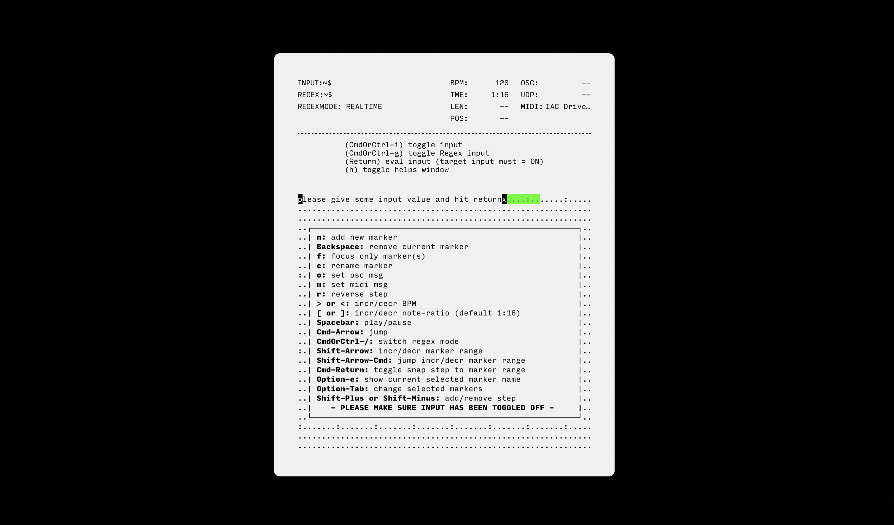

# `anu`

backend-agnostic step-sequencer/live-coding environment that harnesses the power of matching patterns ("RegEx") to create triggers. as the name suggests "anu" (or "อนุ"), which in Thai grammar denotes a prefix meaning "small", "sub" or "minor". it can be compatible with any others software/hardware that support [ OSC ](https://en.wikipedia.org/wiki/Open_Sound_Control) or [MIDI](https://en.wikipedia.org/wiki/MIDI) protocol (more to be implemented).
 
unlike others conventional tools or step-sequencers, "anu" explore a new musical expressions and territories, while still balancing deterministic and stochastic processes (previously developed under the name "seeq").

written in vanillaJS with dependencies as less as possible in mind. powered by [Tauri](https://tauri.app/), a framework for building tiny, blazing fast binaries for all major desktop platforms.

[[ Demo video ]](https://www.youtube.com/watch?v=DGaakhSvYOg)

## usages
soon...

## features
- support OSC, MIDI.
- precise clock scheduling.

## building the native app

- [Install Rust/Cargo](https://www.rust-lang.org/learn/get-started)
- [Install Node/NPM](https://nodejs.org/)
- Run `yarn build`, built file will be located at `src-tauri/target/release/bundle/<depends-on-your-os>`

## developing
- `yarn dev`, for development

## inspirations
draw inspirations from Orca, Sunvox, others obsolete music software.
