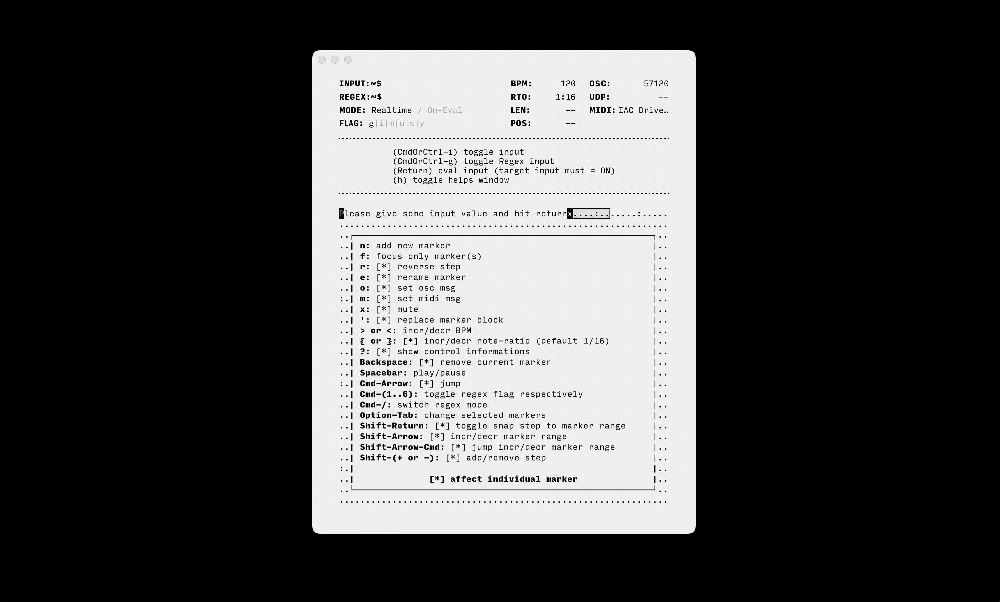
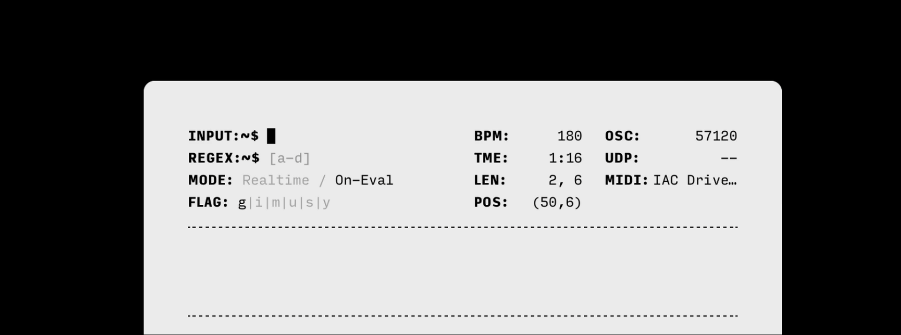
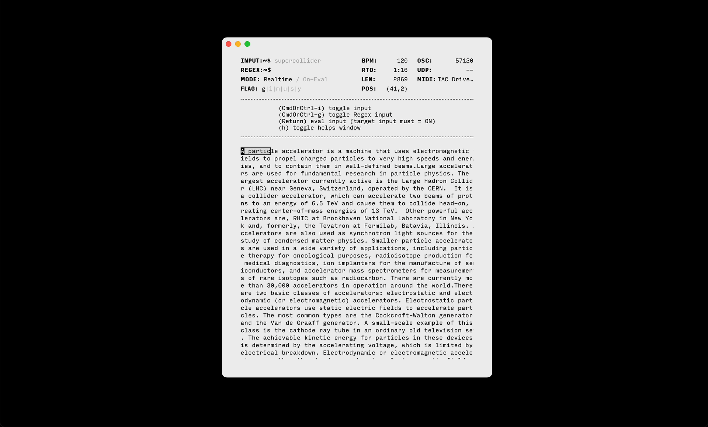
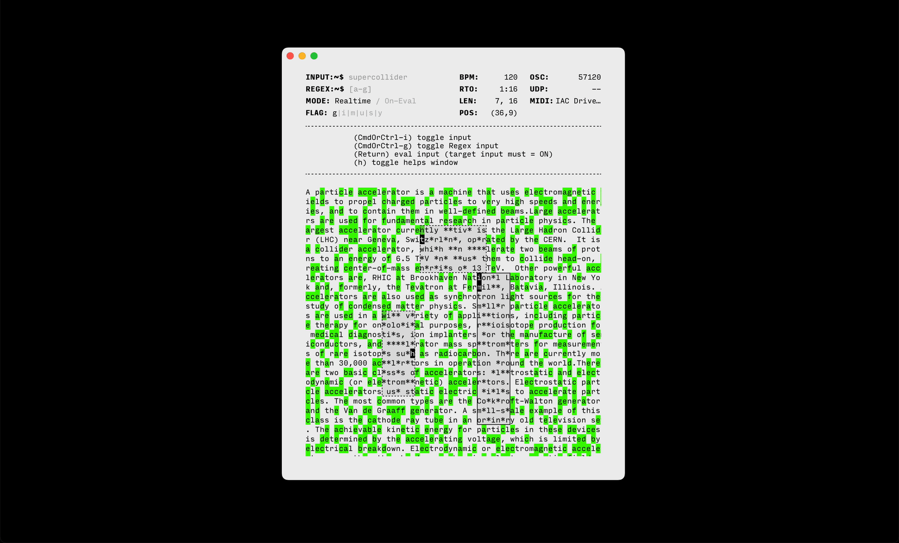
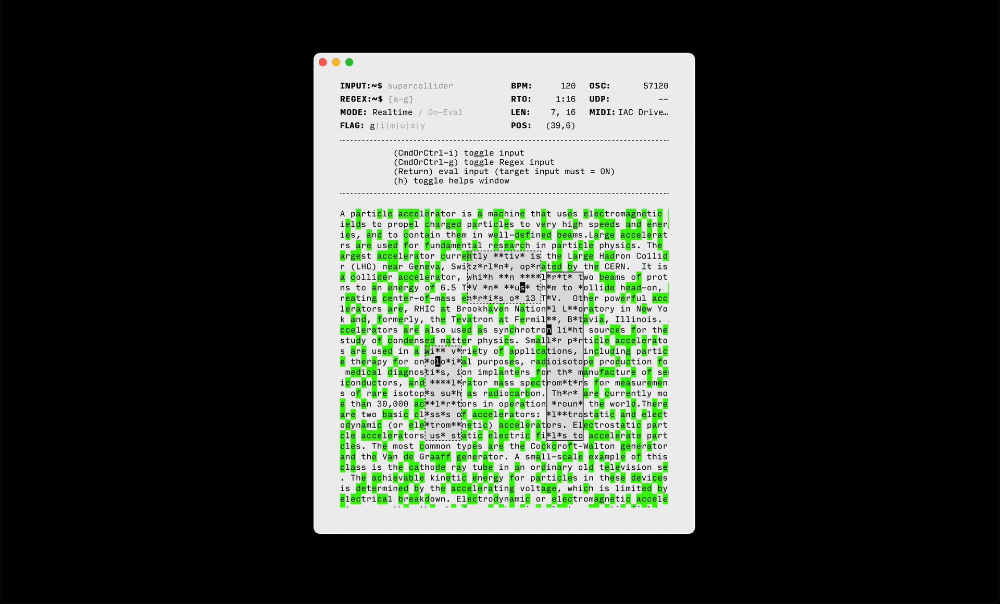

# `anu`

a tiny backend-agnostic step-sequencer/live-coding environment that harnesses the power of matching patterns ([RegEx](https://regexr.com)) to create triggers. as the name suggests "anu" (or "อนุ"), which in Thai grammar denotes a prefix meaning "small", "sub" or "minor". It can be prefixed(compatible) with any others software/hardware that support [ OSC ](https://en.wikipedia.org/wiki/Open_Sound_Control) or [MIDI](https://en.wikipedia.org/wiki/MIDI) protocol (more to be implemented).
 
unlike others conventional step-sequencers, "anu" explore a new musical expressions and territories, while still balancing deterministic and stochastic processes (previously, this project have been developed under the name "seeq").

written in plain JavaScript with dependencies as less as possible in minds. powered by [Tauri](https://tauri.app/), a framework for building tiny, blazing fast binaries for all major desktop platforms.

&nbsp;

for more in-depth details/implementations, please watch: [[ Regular Expression as an Irregular Musical Expression ]](https://www.youtube.com/watch?v=kXfi4FhzCi8), @ CreativeCoding meetup 2023, Thailand (organized by [Creatorsgarten](https://creatorsgarten.org/))

## usages
- [OSC]: sending OSC message (based-on [`oscd`](https://github.com/karnpapon/oscd))
  - in case of sending sequencial messages (like Arpeggiator), use `|` as a delimiter, eg. `"msg1" 440.0 | "msg2" 450.0` will send `"msg1" 440.0` and `"msg2" 450.0`, respectively when triggering. 
  - within sequencial messages, you can have any type that OSC is supported including an Array ([see complete support list here](https://github.com/karnpapon/oscd#usage)), which means you can send something like `"msg1" 440.0 [12,44,true] | "msg2" 450.0 [30,20.1,"msg inside an array"]`

## features
- lightweight and cross-platform (application size only ~9mb)
- support sending OSC
- support sending MIDI
- precise clock scheduling
- mutable marker
- reversable marker
- adjustable BPM (without jittery)
- fault-tolerance regex
- live-performance oriented
- adjustable note-ratio per marker

## building the native app

- [Install Rust/Cargo](https://www.rust-lang.org/learn/get-started)
- [Install Node/NPM](https://nodejs.org/)
- Run `yarn build`, built file will be located at `src-tauri/target/release/bundle/<depends-on-your-os>`

## developing
- `yarn dev`, for development

## caveats
- cannot build on `aarch64` and `arm`, since it's blocked by `linuxdeploy`. [#4174](https://github.com/tauri-apps/tauri/issues/4174#issuecomment-1134954542) [#175](https://github.com/linuxdeploy/linuxdeploy/issues/175)

## inspirations
draw an inspirations from Xenakis's work [Achorripsis](https://muse.jhu.edu/article/7871/summary)(1956) and Esoteric Environment like [Orca](https://hundredrabbits.itch.io/orca) also others obsoleted music software.
